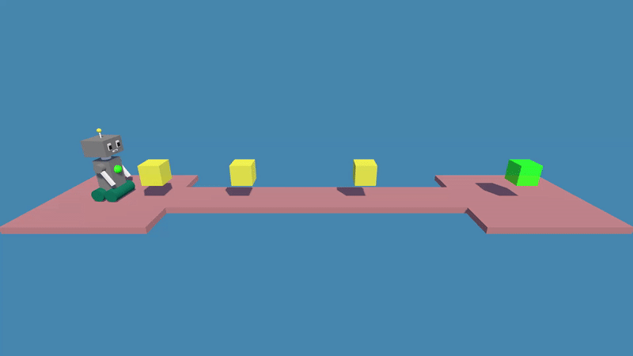
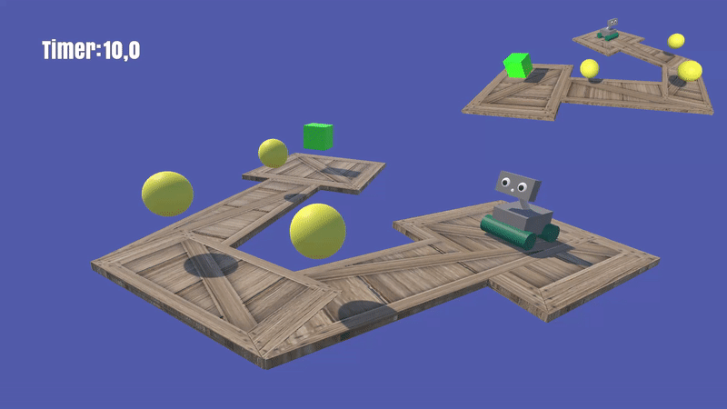

# Reinforcement learning projects
Reinforcement learning projects using ML-Agents in Unity

## The Abysm project - Scene 1 :dart:

### Training and Agent working visualizations

  
   

## The Abysm project - Scene 4 :bicyclist:

### Training and Agent working visualizations

  
   

## The Abysm project - Scene 5 :star2:

### Training and Agent working visualizations

  
   

## Jumping Agents project - Scene 1 :space_invader:

### Training and Agent working visualizations

  
   

